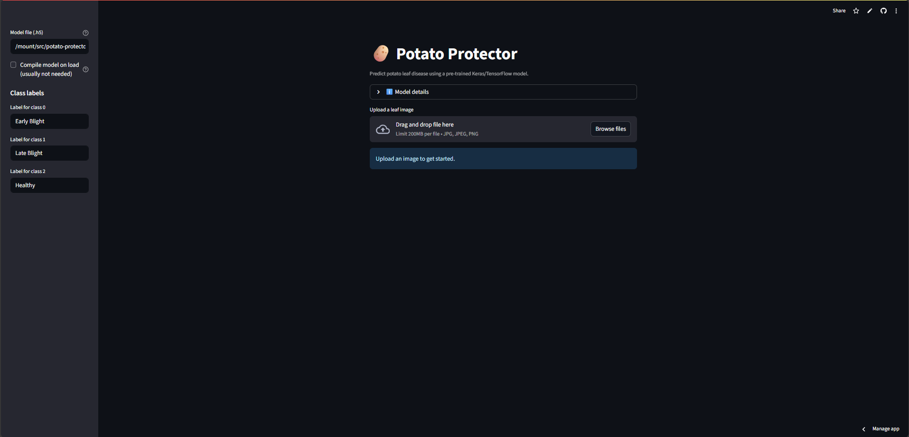
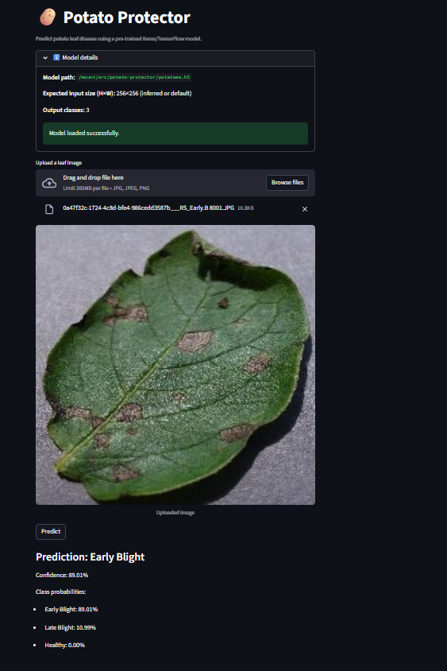

# 🥔 Potato Protector

**Potato Protector** is a deep learning–powered web app that detects **potato leaf diseases** from images.  
Built with **Streamlit** and **TensorFlow/Keras**, it helps farmers and researchers quickly identify plant health issues.

---

## 🚀 Features
- 📸 Upload potato leaf images and get instant predictions  
- 🤖 Pre-trained TensorFlow model (`potatoes.h5`)  
- 📊 Confidence score + probability breakdown  
- 🌐 Easy deployment on **Streamlit Community Cloud**  

---

## 🖼️ Screenshots

### 🔹 Home Page

### 🔹 Prediction Example

---

## 📂 Project Structure
potato-protector/
│── app.py # Streamlit app
│── potatoes.h5 # Trained model (2.2 MB)
│── requirements.txt # Dependencies
│── runtime.txt # Python version for Streamlit Cloud
│── README.md # Project documentation
│── .gitignore # Ignored files
│── pp1.png # Screenshot - Home page
│── pp2.png # Screenshot - Prediction example

---

## ⚙️ Installation & Usage

### 1. Clone the repository

git clone https://github.com/Sahej200/potato-protector.git
cd potato-protector
2. Create and activate a virtual environment

python -m venv .venv
# Windows
.venv\Scripts\activate
# Mac/Linux
source .venv/bin/activate
3. Install dependencies

pip install -r requirements.txt
4. Run the app

streamlit run app.py
☁️ Deployment on Streamlit Cloud
Push this repo to GitHub.

Go to Streamlit Cloud.

Create a new app → connect your repo → set main file path to app.py.

Done! 🚀

🧠 Model Info
Dataset: PlantVillage Potato Dataset

Classes:

Early Blight

Late Blight

Healthy

Frameworks: TensorFlow / Keras

📜 License
This project is open-source and available under the MIT License.

👨‍💻 Author: Sahej Prakash
📧 Contact: [prakash.sahej@gmail.com]

